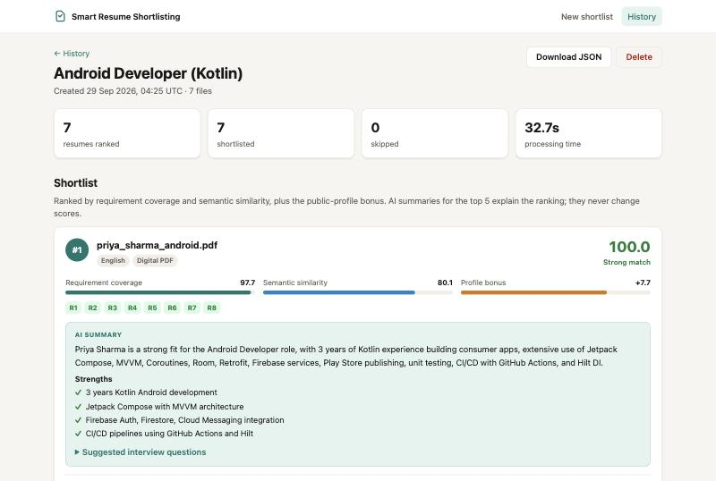
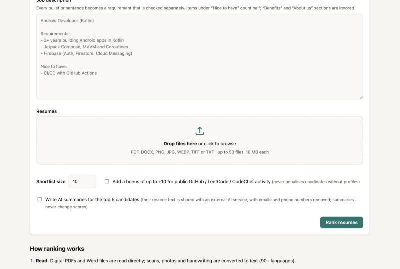
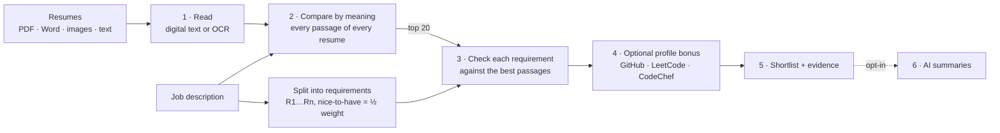

# Smart Resume Shortlisting System

[](https://github.com/Varad1006/Smart-resume-shortlisting-system/actions/workflows/ci.yml)


Rank a pile of resumes against a job description and see **why** each candidate ranks
where they do. Resumes can be PDFs, Word files, scans or phone photos (including
handwriting), in 90+ languages.

- **Reads everything.** Digital PDFs and Word documents (including text boxes, tables,
  headers and hidden links) are read directly. Scans, photos and handwriting are
  converted to text with OCR.
- **Multilingual.** Resumes are compared with the job by meaning, not keywords, so a Hindi
  or French resume can match an English job description.
- **Explainable.** Every requirement in the job description is scored separately, with the
  passage from the resume that satisfies it.
- **Fair profile bonus (opt-in).** Public GitHub, LeetCode and CodeChef activity can add up
  to +10 points and never counts against candidates who have no profiles.
- **AI summaries (opt-in).** Strengths, gaps and interview questions for the top
  candidates. They explain the ranking and never change a score.
- **One command.** `docker compose up` starts the web app, with a history of past runs.



---

## Quick start

```bash
git clone https://github.com/Varad1006/Smart-resume-shortlisting-system.git
cd Smart-resume-shortlisting-system
cp .env.example .env        # add your OCR key and, optionally, an AI summary key
docker compose up --build   # the first build takes a few minutes
```

Open **http://localhost:8000**, paste a job description and drop in resumes. The
[`samples/`](samples) folder has a job description and seven synthetic resumes covering
every format and three languages. To upload them all at once:

```bash
uv run python scripts/smoke_test.py --insights      # or: make smoke
```

Without an OCR key, scans are still read by the built-in OCR, at lower quality.



## How it works



```
final score  = min(100, relevance + profile bonus)   # bonus: 0-10, opt-in, never negative
relevance    = 30% semantic similarity + 70% requirement coverage
coverage     = weighted mean over requirements of P(resume satisfies requirement)
```

1. **Read.** Each PDF page uses its embedded text when it has some; only pages without
   text are sent to OCR. Duplicate, empty and unreadable files are listed with a reason
   instead of being dropped silently.
2. **Compare by meaning.** Resumes are split into overlapping ~50-word passages, so skills
   listed anywhere in a resume count, and every passage is compared with the job.
3. **Check each requirement.** The job description is split into requirements, and each
   one is scored against the candidate's most relevant passages. The best passage is kept
   as evidence.
4. **Profiles (optional).** Usernames are taken from the resume text and from embedded
   links. The bonus reflects the strongest profile, with diminishing returns.
5. **AI summaries (optional).** Written after ranking, for the top candidates only.
   Contact details are removed first.

Measured on synthetic resumes for an *Android Developer (Kotlin)* role
([`tests/integration/test_ranking_quality.py`](tests/integration/test_ranking_quality.py)):

| Resume | Language | Semantic | Coverage | **Final** |
|---|---|---:|---:|---:|
| Android developer | English | 86.2 | 99.7 | **95.7** |
| Android developer | Hindi | 71.3 | 90.4 | **84.7** |
| Android developer | French | 67.9 | 90.1 | **83.5** |
| iOS developer | English | 42.3 | 11.4 | **20.6** |
| Web developer | English | 31.5 | 0.2 | **9.6** |
| Accountant | English / Hindi | 13.0 / 5.1 | 0.0 / 0.4 | **3.9 / 1.8** |

## Configuration

All settings live in `.env`; [`.env.example`](.env.example) lists them.

| Setting | Default | Meaning |
|---|---|---|
| `OCR_KEY` | — | Key for high-quality OCR of scans, photos and handwriting |
| `OCR_MODE` | `balanced` | `fast` · `balanced` · `accurate` |
| `AI_SUMMARY_KEY` | — | Enables the AI summaries option |
| `APP_PORT` | `8000` | Port the app uses on your machine |
| `RETRIEVAL_TOP_K` | `20` | Resumes checked requirement by requirement |
| `SEMANTIC_WEIGHT` / `COVERAGE_WEIGHT` | `0.3` / `0.7` | Relevance blend |
| `SOCIAL_MAX_BONUS` | `10` | Maximum profile bonus |
| `GITHUB_TOKEN` | — | Raises the limit for public GitHub profile lookups |
| `MAX_FILES` / `MAX_FILE_MB` / `MAX_TOTAL_MB` | `50` / `10` / `100` | Upload limits |

## Architecture

The code follows a clean (ports-and-adapters) architecture, with dependencies pointing
inwards only:

- **Domain:** pure rules for parsing requirements, splitting passages, scoring, profile
  links and redaction. No I/O.
- **Application:** the shortlisting use case, written against small interfaces.
- **Adapters:** file reading, OCR, text matching, public profiles, AI summaries and
  SQLite storage.
- **Web layer:** pages and routes, wired together in a single composition root.

See [`docs/architecture.md`](docs/architecture.md) for the design decisions.

## Development

Requires [uv](https://docs.astral.sh/uv/) and Python 3.12.

```bash
uv sync                 # install
make dev                # http://localhost:8000 with auto-reload
make test               # 156 fast tests
make test-slow          # ranking quality, end to end
make lint               # ruff
make docker-test        # full suite inside the production image
```

On a Linux machine with an NVIDIA GPU, `docker compose --profile gpu up --build` also
starts a self-hosted OCR server, so scans never leave your infrastructure.

## Privacy and security

- Uploaded files are processed in memory and never written to disk. The database keeps
  scores and short evidence snippets, never full resume text, and runs can be deleted.
- Only scans that need OCR are sent to the OCR service. Each result is deleted from the
  service as soon as it has been read.
- AI summaries only run when you tick the box, and emails and phone numbers are removed
  first.
- Keys live in `.env`, which is excluded from git and from the Docker build.
- The app has no login, so it only listens on `127.0.0.1`. Put it behind an
  authenticating reverse proxy before exposing it.

## What changed from v1

The first version (a single server script plus a React app, previously uploaded as a zip)
was rebuilt from scratch. Problems fixed along the way:

- The server could not start from a clean install, because a required package was missing.
- Reading scans only worked on Windows.
- Scores were on the wrong scale, so the ranking was unreliable.
- Only the first ~200 words of each resume were considered.
- Translation was limited to 500 characters and sent resumes to a third party.
- LeetCode totals were double-counted, new-style profile links were misread, and CodeChef
  and GitHub star counts were always 0.
- Candidates without coding profiles lost up to 30 points.
- Several server routes could never work.
- Every stored resume could be read without logging in.

## Limitations

- CodeChef has no official data feed, so its public profile page is read on a
  best-effort basis.
- Score calibration is tuned for the default text matcher. Re-measure it if you change it.
- Runs execute one at a time by default. For heavy use, run several containers behind a
  queue.
