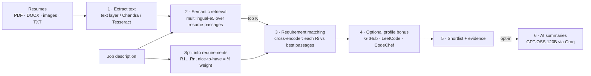

# Smart Resume Shortlisting System

[](https://github.com/Varad1006/Smart-resume-shortlisting-system/actions/workflows/ci.yml)


Rank a pile of resumes against a job description and see **why** each candidate ranks
where they do. Resumes can be PDFs, Word files, scans or phone photos (including
handwriting), in any of 90+ languages.

- **Reads everything.** Embedded PDF text, DOCX (including text boxes, tables, headers
  and hidden hyperlinks) and plain text. Scans and photos go through
  **[Chandra OCR](https://github.com/datalab-to/chandra)**, with Tesseract as a CPU fallback.
- **Multilingual without translation.** Multilingual models match an English job
  description against Hindi, Marathi, French and other resumes directly. Ranking runs
  entirely on your server.
- **Explainable.** Every job requirement is scored separately, with the passage from the
  resume that satisfies it.
- **Fair profile bonus (opt-in).** Public GitHub, LeetCode and CodeChef activity can add up
  to +10 points and never counts against candidates who have no profiles.
- **AI summaries (opt-in).** GPT-OSS 120B on Groq, or any OpenAI-compatible LLM, writes
  strengths, gaps and interview questions for the top candidates. It explains the ranking
  and never changes a score.
- **One command.** `docker compose up`: a FastAPI service with a web UI, a REST API and
  SQLite history, running fully offline on CPU.


---

## Quick start

```bash
git clone https://github.com/Varad1006/Smart-resume-shortlisting-system.git
cd Smart-resume-shortlisting-system
cp .env.example .env             # optional: add LLM_API_KEY to enable AI summaries
docker compose up --build        # first build downloads ~1 GB of models into the image
```

Open **http://localhost:8000**, paste a job description and drop in resumes. The
[`samples/`](samples) folder has a job description and seven synthetic resumes covering
every format and three languages. To upload them all from the command line:

```bash
uv run python scripts/smoke_test.py      # or: make smoke   (add --insights for AI summaries)
```


## Chandra OCR (scans, handwriting, 90+ languages)

Chandra is a 5B-parameter vision-language OCR model. It needs an **NVIDIA GPU** (24 GB+
VRAM recommended), so the app talks to it over HTTP (an OpenAI-compatible vLLM server)
instead of loading it in-process. With the default `OCR_ENGINE=auto`, the app uses Chandra
whenever the server is reachable and falls back to Tesseract otherwise. The chip at the top
of the home page shows which engine is active.

| Where you run it | How |
|---|---|
| Linux + NVIDIA GPU | `docker compose --profile gpu up --build` starts the app plus a `vllm/vllm-openai` server hosting `datalab-to/chandra-ocr-2`. |
| Mac / no GPU, with a GPU box elsewhere | Start vLLM on the GPU machine (command below) and set `CHANDRA_API_BASE=http://<gpu-host>:8000/v1` in `.env`. |
| No GPU at all | Leave it as is: scans are read with Tesseract (`eng`, `hin` and `mar` packs are included). |

```bash
# On the GPU machine (the same settings the compose "chandra" service uses):
docker run --gpus all --ipc=host -p 8000:8000 -v ~/.cache/huggingface:/root/.cache/huggingface \
  vllm/vllm-openai:v0.17.0 --model datalab-to/chandra-ocr-2 --served-model-name chandra \
  --dtype bfloat16 --max-model-len 18000 --gpu-memory-utilization 0.85 --enable-prefix-caching \
  --mm-processor-kwargs '{"min_pixels": 3136, "max_pixels": 6291456}'
```

> Docker on macOS cannot pass through the Apple GPU, so Chandra can't run in a container
> on a Mac. The Chandra model weights use a modified OpenRAIL-M licence: free for research,
> personal use and startups under $2M in funding or revenue.

## AI summaries (GPT-OSS 120B on Groq)

With an API key in `.env`, the home page offers **"Write AI summaries"**. For the top
`LLM_MAX_CANDIDATES` shortlisted candidates (default 5), the LLM receives the parsed
requirements, the match scores and evidence, and the resume text. It returns a short
assessment with strengths, gaps and suggested interview questions, which appears on each
candidate card.

```bash
LLM_API_KEY=gsk_...                              # from console.groq.com
LLM_BASE_URL=https://api.groq.com/openai/v1      # any OpenAI-compatible API works
LLM_MODEL=openai/gpt-oss-120b
LLM_MAX_TOKENS=1200                              # per request, see below
```

- **Scores stay local and deterministic.** Summaries are generated after ranking and
  never change a score, so a failed or rate-limited LLM call can't break a run.
- **Less personal data leaves your server.** Email addresses and phone numbers are
  removed before resume text is sent, and nothing is sent unless you tick the box.
- **Fits free-tier limits.** Groq's free tier allows 8,000 tokens per minute and counts
  each request's `max_tokens` against that budget. Summaries are therefore requested one
  at a time, capped at 1,200 tokens, with automatic retry after HTTP 429. Setting the
  model's maximum (65,536) would make every request fail on that tier.

## How ranking works



```
final score  = min(100, relevance + profile bonus)   # bonus: 0-10, opt-in, never negative
relevance    = 30% semantic similarity + 70% requirement coverage
coverage     = weighted mean over requirements of P(resume satisfies requirement)
```

1. **Extract.** Each PDF page uses its embedded text when it has some; only pages
   without text are OCR'd. Duplicate, empty and unreadable files are listed with a reason
   instead of being dropped silently.
2. **Retrieve.** Resumes are split into overlapping ~50-word passages (a transformer
   only reads its first ~512 tokens, so embedding a whole resume ignores most of it). Each
   resume is scored by its best passage using
   [`intfloat/multilingual-e5-small`](https://huggingface.co/intfloat/multilingual-e5-small).
3. **Match requirements.** Cross-encoders are trained on short queries. Given a whole job
   description they output saturated logits for every resume, so the job description is
   split into requirements and each one is scored against the candidate's most relevant
   passages with
   [`cross-encoder/mmarco-mMiniLMv2-L12-H384-v1`](https://huggingface.co/cross-encoder/mmarco-mMiniLMv2-L12-H384-v1).
   A sigmoid turns the logits into probabilities.
4. **Profiles (optional).** Usernames are taken from the resume text and from embedded
   hyperlinks. The bonus reflects the strongest profile, with diminishing returns.

Measured with the real models on synthetic resumes for an *Android Developer (Kotlin)*
role ([`tests/integration/test_real_models.py`](tests/integration/test_real_models.py)):

| Resume | Language | Semantic | Coverage | **Final** |
|---|---|---:|---:|---:|
| Android developer | English | 86.2 | 99.7 | **95.7** |
| Android developer | Hindi | 71.3 | 90.4 | **84.7** |
| Android developer | French | 67.9 | 90.1 | **83.5** |
| iOS developer | English | 42.3 | 11.4 | **20.6** |
| Web developer | English | 31.5 | 0.2 | **9.6** |
| Accountant | English / Hindi | 13.0 / 5.1 | 0.0 / 0.4 | **3.9 / 1.8** |

## REST API

Interactive docs are at **`/docs`**. Runs are asynchronous: submit, then poll.

| Method | Path | Purpose |
|---|---|---|
| `POST` | `/api/v1/shortlists` | Start a run (multipart: `job_description`, `files[]`, `shortlist_size`, `include_social`, `include_insights`) → `202` |
| `GET` | `/api/v1/shortlists/{id}` | Progress, then results (scores, requirement matches, evidence) |
| `GET` | `/api/v1/shortlists` | History (`limit`, `offset`) |
| `DELETE` | `/api/v1/shortlists/{id}` | Delete a run (cancels it if running) |
| `POST` | `/api/v1/extract` | Extract text from one file: check OCR quality |
| `GET` | `/api/v1/status` | OCR engines and model status |
| `GET` | `/health` | Liveness probe |

```bash
curl -F "job_description=<samples/job_description.txt" \
     -F files=@samples/priya_sharma_android.pdf -F files=@samples/rahul_verma_web.docx \
     http://localhost:8000/api/v1/shortlists
```

## Configuration

Everything is set through environment variables, or a `.env` file; see
[`.env.example`](.env.example). The most useful ones:

| Variable | Default | Meaning |
|---|---|---|
| `OCR_ENGINE` | `auto` | `auto` · `chandra` · `tesseract` · `none` |
| `CHANDRA_API_BASE` | `http://chandra:8000/v1` (compose) | OpenAI-compatible Chandra server |
| `TESSERACT_LANGS` | `eng` | e.g. `eng+hin+mar` |
| `EMBEDDING_MODEL` / `RERANKER_MODEL` | multilingual e5-small / mMARCO MiniLM | Any sentence-transformers models |
| `MODEL_DEVICE` | `cpu` | `cpu` · `cuda` · `mps` · `auto` |
| `RETRIEVAL_TOP_K` | `20` | Resumes promoted to requirement matching |
| `SEMANTIC_WEIGHT` / `COVERAGE_WEIGHT` | `0.3` / `0.7` | Relevance blend |
| `SOCIAL_MAX_BONUS` | `10` | Maximum profile bonus |
| `GITHUB_TOKEN` | — | Raises the GitHub API limit from 60 to 5000 requests/hour |
| `LLM_API_KEY` | — | Enables AI summaries (Groq key by default) |
| `LLM_BASE_URL` / `LLM_MODEL` | Groq / `openai/gpt-oss-120b` | Any OpenAI-compatible chat API |
| `LLM_MAX_TOKENS` / `LLM_MAX_CANDIDATES` | `1200` / `5` | Output cap per request, summaries per run |
| `MAX_FILES` / `MAX_FILE_MB` / `MAX_TOTAL_MB` | `50` / `10` / `100` | Upload limits |

## Architecture

The code follows a clean (ports-and-adapters) architecture. Dependencies point inwards only.
See [`docs/architecture.md`](docs/architecture.md) for the design decisions.

```
src/resume_shortlister/
├── domain/            # pure rules: requirements, chunking, scoring, profiles, redaction
├── application/       # ShortlistService use case + ports (Protocols) + DTOs
├── infrastructure/    # adapters
│   ├── extraction/    #   PDF (pypdfium2), DOCX (python-docx), images, text
│   ├── ocr/           #   Chandra (vLLM over HTTP), Tesseract, fallback chain
│   ├── nlp/           #   sentence-transformers embedder + cross-encoder, langdetect
│   ├── social/        #   GitHub REST, LeetCode GraphQL, CodeChef (best effort)
│   ├── llm/           #   OpenAI-compatible summarizer (GPT-OSS 120B on Groq)
│   └── persistence/   #   SQLite repository
├── api/               # FastAPI: REST routes, Jinja2 UI, schemas, error mapping
├── bootstrap.py       # composition root (the only place that wires adapters to ports)
└── config.py          # pydantic-settings
```

## Development

Requires [uv](https://docs.astral.sh/uv/) and Python 3.12. Tesseract is optional locally
(`brew install tesseract`).

```bash
uv sync                 # install (torch is CPU-only on Linux)
make dev                # http://localhost:8000 with auto-reload
make test               # 145 fast tests: fakes, no model downloads
make test-slow          # ranking quality with the real models
make lint               # ruff
make docker-test        # full suite inside the production image (with Tesseract)
```

## Privacy and security

- Resume files are processed in memory and never written to disk. The database keeps
  scores and short evidence snippets, never full resume text, and runs can be deleted from
  the UI or API.
- Logs contain run IDs and counts, never names or resume content.
- The compose file binds to `127.0.0.1` because the app has **no authentication**. Put it
  behind an authenticating reverse proxy before exposing it.
- Profile lookups only happen when you tick the box, and only for the top candidates.
- AI summaries only run when you tick the box. Only the top candidates' resume text is
  sent to the LLM provider, with emails and phone numbers removed. API keys live in `.env`,
  which is excluded from git and from the Docker build context.

## What changed from v1

The first version (a single `server.py` plus a React app, previously uploaded as a zip)
was rebuilt from scratch. Problems fixed along the way:

- The server could not start from a clean install: `pinecone` was imported but not listed
  as a dependency.
- OCR only worked on Windows: the Tesseract path was hard-coded to a `.exe` file.
- Cross-encoder logits were multiplied by 100 and displayed with `% 100`. The ranking was
  driven by those raw numbers.
- Only the first ~200 words of each resume were embedded.
- Translation used a web API limited to 500 characters and sent resumes to a third party.
- LeetCode totals were double-counted, `leetcode.com/u/<name>` links were parsed as the
  username "u", and CodeChef and GitHub stars were always 0.
- Candidates without coding profiles lost up to 30 points.
- Several endpoints could not work: a `NameError` in `/upload-resume`, a vector-size
  mismatch in the Pinecone routes, and a route defined twice.
- Every stored resume was exposed through an unauthenticated endpoint, and model inference
  blocked the event loop.

## Limitations

- CodeChef has no public API; its profile page is scraped on a best-effort basis.
- The score calibration (`SEMANTIC_FLOOR` / `SEMANTIC_CEILING`) is tuned for the default
  embedding model. Re-measure it if you swap models.
- Runs execute in-process, one at a time by default. For heavy use, run several containers
  behind a queue.
