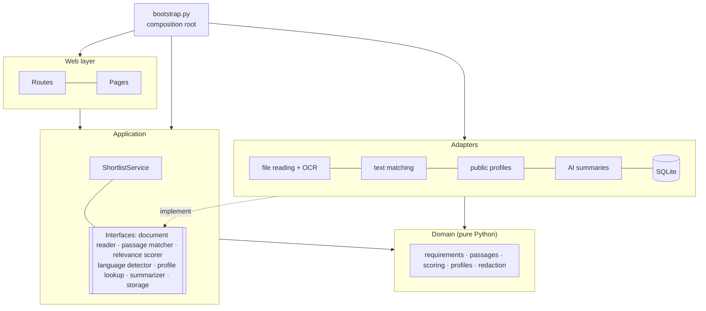
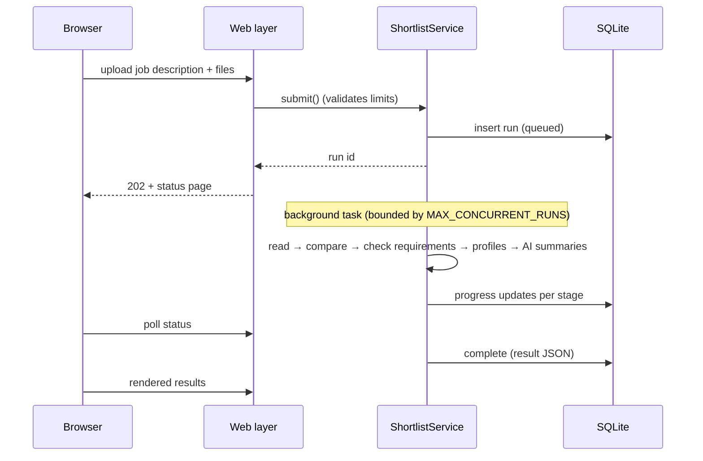

# Architecture

## Layers and the dependency rule

* **Domain** has no I/O and no third-party imports. Parsing, scoring and ranking rules
  are plain functions that are easy to unit-test.
* **Application** runs the pipeline through `typing.Protocol` interfaces. It knows nothing
  about the web framework, the matching libraries, HTTP or SQLite. Tests drive it with
  in-memory fakes (`tests/fakes.py`).
* **Adapters** implement the interfaces. Heavy libraries are imported lazily, so importing
  the package stays cheap.
* **`bootstrap.py`** is the only module that decides which adapter backs which interface,
  based on `config.Settings`. The web tests swap in fakes by building their own
  `Container`.

## Lifecycle of a run

CPU-heavy work (PDF rendering, OCR, text matching) runs in worker threads through
`asyncio.to_thread`, so the server stays responsive during a run. On startup, any run
left unfinished by a crash is marked as failed.

## Design decisions

**Checking requirements one by one.** Relevance scorers work best with short queries.
When a whole job description was used as a single query, every resume scored near the
maximum, and an accountant's resume outranked a web developer's. Splitting the
description into requirements fixes this: strong candidates cover 60–90% of the
requirements while unrelated ones stay near 0, and each score comes with a readable piece
of evidence.

**Matching across languages without translation.** The first version translated resumes
through a free web service that capped text at 500 characters and received the resume
contents. Resumes are now compared with the job by meaning directly, whatever language
they are written in, with no translation step and no third party involved.

**OCR with a fallback.** Scans are read by the best available engine: a self-hosted OCR
server on a GPU machine if one is running, otherwise the hosted OCR service when a key
is configured, otherwise the built-in engine. The hosted service receives each document
as a single request. The app builds the result URL itself, so the key is only ever sent
to the configured host, and deletes the stored result as soon as it has been read.

**Calibrated scores.** Raw similarity values fall in a narrow band, so they are mapped
onto 0–100 using configurable bounds (`SEMANTIC_FLOOR`, `SEMANTIC_CEILING`). Requirement
scores are probabilities.

**A profile bonus that never penalises.** The bonus is additive, capped at
`SOCIAL_MAX_BONUS`, and based on the strongest profile, so adding a weaker profile can't
lower it. A missing profile means no bonus rather than a lower score. Final scores are
capped at 100, and ties are broken by relevance.

**Short passages.** Passages were first 120 words long. A resume's key sentence
("Published 4 apps on the Google Play Store…") then competed with a lot of unrelated
text, and a clearly met requirement scored 9%. With 50-word passages and 15 words of
overlap, coverage for strong candidates rose from about 75 to 92, while unrelated resumes
scored the same as before.

**PDF reading behind a lock.** Several resumes are read in parallel worker threads, but
the PDF library is not thread-safe: two threads inside it at once crash the process.
Every call into it runs under a single lock (a regression test reads 48 PDFs from 8
threads), and OCR, the slow part, runs outside that lock.

**AI summaries after ranking, never in it.** The optional summary step receives the
requirements, match scores, evidence and the resume text with contact details removed,
and returns strengths, gaps and interview questions. It runs after scores are final, one
request at a time with capped output, so a failure only adds a note to that candidate's
card.

**Persistence.** A single SQLite table stores the job description, options, progress and
the result as JSON. Full resume text is never stored.

**Dependencies.** `pypdfium2` (a permissive licence) replaces the AGPL-licensed PyMuPDF and
the deprecated PyPDF2. The Linux build uses CPU-only PyTorch, which keeps the Docker
image several GB smaller.
