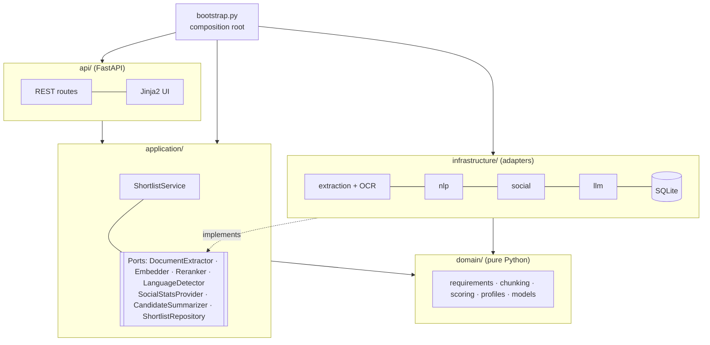
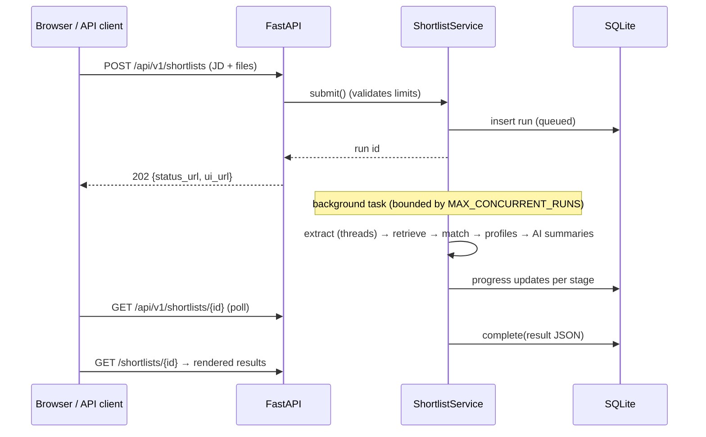

# Architecture

## Layers and the dependency rule

* **Domain** has no I/O and no third-party imports: parsing, scoring and ranking rules are
  plain functions that are trivial to unit-test.
* **Application** orchestrates the pipeline through `typing.Protocol` ports. It knows
  nothing about FastAPI, PyTorch, HTTP or SQLite. Tests run it with in-memory fakes
  (`tests/fakes.py`).
* **Infrastructure** adapters implement the ports. Heavy libraries are imported lazily,
  so importing the package stays cheap.
* **`bootstrap.py`** is the only module that decides which adapter backs which port,
  driven by `config.Settings`. The API tests swap in fakes by building their own
  `Container`.

## Lifecycle of a run

CPU-bound work (PDF rendering, OCR, embeddings, cross-encoding) runs in worker threads
through `asyncio.to_thread`, so the event loop stays responsive while a run is in
progress. On startup, runs left unfinished by a crash are marked as failed.

## Design decisions

**Requirement-level reranking instead of scoring the whole job description at once.**
MS MARCO cross-encoders are trained on short queries. When a whole job description was
used as the query, every resume received a large positive logit (a sigmoid gives about
1.0 for all of them), and a Hindi-language accountant was ranked above a web developer.
Splitting the job description into requirements puts the model back in its training
distribution. Strong candidates then cover 0.6–0.9 of the requirements while unrelated
ones stay near 0, and each score comes with a readable piece of evidence.

**Multilingual models instead of machine translation.** The original design translated
resumes through a free web API that has a 500-character limit and sees the resume
contents. `multilingual-e5-small` and the mMARCO cross-encoder compare text across
languages directly. There's no translation step, no network call and no third party
involved.

**Chandra behind HTTP, with a fallback.** Chandra 2 (5B parameters) needs an NVIDIA GPU,
and Docker on macOS has no GPU passthrough. The adapter talks to an OpenAI-compatible
vLLM server through the official `chandra-ocr` client, which handles prompting, retries
and repeat-token detection. It probes `/models` (cached for 30 s) before use, and
`FallbackOcrEngine` switches to Tesseract when the server is unreachable. Chandra's layout
HTML is flattened block by block, so separate blocks such as a name and a job title never
run together.

**Calibrated scores.** e5 cosine similarities fall in a narrow band (about 0.78 for an
unrelated resume up to 0.93 for a close match). They are mapped linearly onto 0–100 using
the configurable bounds `SEMANTIC_FLOOR` and `SEMANTIC_CEILING`. Reranker logits go
through a sigmoid.

**Profile bonus that never penalises.** The bonus is additive, capped at
`SOCIAL_MAX_BONUS`, and based on the strongest profile, so adding a weaker profile can't
lower it. A missing profile means no bonus rather than a lower score.

**Persistence.** A single SQLite table stores the job description, options, progress,
and the result as JSON, via pydantic `TypeAdapter`s over the domain dataclasses. Full
resume text is never stored.

**Short passages for the reranker.** Passages were first 120 words long. A resume's key
sentence ("Published 4 apps on the Google Play Store…") then competed with a lot of
unrelated text, and a clearly met requirement scored 9%. Moving to 50-word passages with
15 words of overlap raised coverage for strong candidates from about 75 to 92, without
changing the scores of unrelated resumes (measured in `tests/integration/test_real_models.py`).

**PDFium behind a lock.** Several resumes are extracted in parallel worker threads, but
PDFium is not thread-safe: two threads inside it at once abort the process. Every PDFium
call runs under a single lock (a regression test extracts 48 PDFs from 8 threads). OCR,
the slow part, runs outside the lock.

**AI summaries after ranking, never in it.** The optional LLM step (default GPT-OSS 120B
on Groq, through any OpenAI-compatible API) receives the requirements, match scores,
evidence and redacted resume text, and returns JSON (strengths, gaps, interview
questions). It runs after scores are final, one request at a time with capped output, so
it fits free-tier token limits, and a failure only shows a note on that candidate's card.

**Dependencies.** `pypdfium2` (Apache/BSD licence) replaces AGPL-licensed PyMuPDF and the
deprecated PyPDF2. torch is CPU-only on Linux (see `[tool.uv.sources]` in
`pyproject.toml`), which keeps the image several GB smaller.
